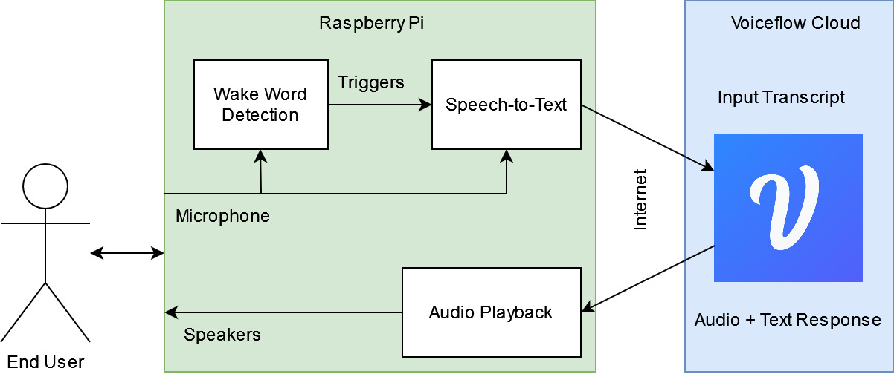

# rpi-voice-assistant
A Raspberry Pi based voice assistant running logic on Voiceflow



## Preparation

### Hardware
You must have a Python3-enabled system with audio input/output capability. 
The audio capture device must be capable of capturing at 16Khz. 

### System dependencies
This application requires the `PyAudio` package that has system dependencies: 
```bash
sudo apt-get install -y python3 python3-pip python3-all-dev python3-pyaudio portaudio19-dev libsndfile1 mpg123
```

### Python dependencies
Python dependencies can be installed with the following command: 
```bash
pip3 install -r requirements.txt
```

### GCP Account
The RPI voice assistant requires Google Speech-to-text API access.  
Make sure that your user/service account has the correct access permissions.  
Setup instructions can be found on the [official guide](https://cloud.google.com/speech-to-text/docs/libraries).

### App configuration
The Voiceflow API key must be specified as an environment variable `VF_API_KEY`. You can learn more about Voiceflow API keys and how to generate them [here](https://www.voiceflow.com/blog/voiceflow-api).  

To run the application, you must specify the following in the `config.yaml`: 
| Parameter | Purpose |
| --------- | ------- |
| vf_DiagramID | The Voiceflow diagram ID of your target skill |
| vf_VersionID | The Voiceflow runnable version ID of your target skill |
| wakeword | A list of `porcupine`-supported wake word(s) that can be used to invoke the system |

## Usage
Run 
```bash
python3 ./src/main.py
```